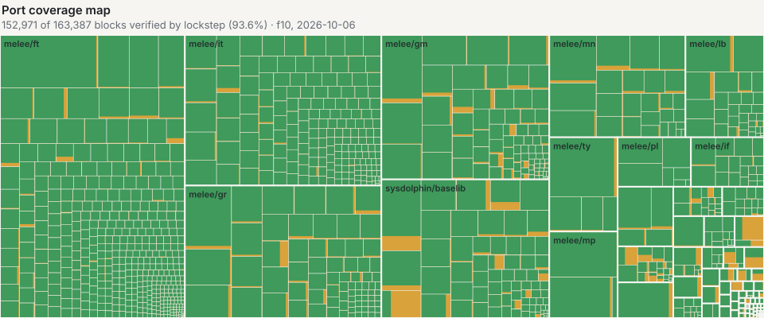

# ssbm-rs

A Rust port of Super Smash Bros. Melee NTSC 1.02 (GALE01 revision 2), built from the [Melee decompilation](https://github.com/doldecomp/melee) and checked against the original game.

The project aims to preserve the game's behavior, including its floating-point results and memory layout. Rust functions are checked call by call against the original machine code, and recorded games are checked against their Slippi replays. The translator, runtime, and verification tools are also intended as a research resource for similar projects.

<a href="https://claude.ai/artifact/T1No6obYSvv81w5vVLpLkb"><picture>
  <source media="(prefers-color-scheme: dark)" srcset="docs/progress/coverage-dark.svg">
  
</picture></a>

Interactive: [Port Coverage Map](https://claude.ai/artifact/T1No6obYSvv81w5vVLpLkb) · [Graphics and Audio Ladder](https://claude.ai/artifact/Ppx3oVXq7qbkRck8tvcrZ4) · [about the dashboards](docs/progress/README.md)

**Development preview:** a windowed player with audio, keyboard, gamepad, and GameCube adapter support exists. The full verification gate and release validation on Windows, macOS, and Linux remain work in progress. See [verification and limitations](docs/verification.md).

Players supply their own disc image. The source tree contains no bundled disc image or extracted assets; the runtime loads the game's assets and data tables from the disc.

## Download and play

Download the latest version from [Releases](https://github.com/itsarahtonin/ssbm-rs/releases/latest): `ssbm-rs.exe` for Windows 10 and 11, `ssbm-rs-macos.zip` for macOS 11 or later (Apple silicon or Intel), or `ssbm-rs-x86_64.AppImage` for Linux. Open it. The first time, it asks for your disc image and remembers it. The supported game is the US NTSC 1.02 release (GALE01 revision 2); other revisions and modded discs are unsupported. The builds aren't code-signed, so Windows and macOS ask once whether to run them; each release's notes explain how to allow it.

ISO, RVZ, CISO, and GCZ images are supported through [nod](https://github.com/encounter/nod). The loader checks the game ID and revision, then verifies `main.dol` when booting. A full-disc SHA-1 check is available separately; opening an image does not hash the whole disc.

The player keeps its disc path and memory card in an `ssbm-rs` directory under `APPDATA` on Windows, `XDG_CONFIG_HOME` when set, or `~/.config` otherwise. Saves modify that card.

### Build from source

Install Rust through [rustup](https://rustup.rs). [rust-toolchain.toml](rust-toolchain.toml) pins the toolchain; Windows also requires the Visual Studio C++ build tools. Linux player builds need a C toolchain, pkg-config, and the ALSA and udev development libraries.

```sh
cargo build --locked --release -p ssbm-run --features player
```

Launch `target/release/ssbm-run.exe` on Windows, or `target/release/ssbm-run` on Linux and macOS. `bash tools/run/release.sh` packages a release for the system it runs on, with its license notices; the [release workflow](.github/workflows/release.yml) builds Windows, macOS, and Linux releases from a version tag.

### Controls

| Input | Mapping |
| --- | --- |
| Keyboard | Arrows: stick; X: A; Z: B; C: X; S: Y; D: Z; Q/W: L/R; Enter: Start; I/J/K/L: C-stick |
| Gamepad | South/west/east/north: A/B/X/Y; right shoulder: Z; triggers: L/R |
| GameCube adapter | Nintendo WUP-028 or Mayflash in Wii U mode; controllers use their adapter ports |

The keyboard and first ordinary gamepad share the first port without an adapter controller. Windows adapters require a WinUSB driver; another program cannot hold the adapter open at the same time. [Player and verification tools](tools/gx/README.md) cover calibration, rumble, and troubleshooting.

## Project scope

This repository develops and preserves the faithful port and the tools used to verify it. Competitive VS is the first priority; menus, single-player modes, and unusual hardware paths also need verification.

A later idiomatic Rust refactor with netplay, training tools, and mods is intended for a **separate repository based on this one**. The faithful port remains useful as its reference and as an independently readable research artifact. See the [roadmap](docs/roadmap.md) and [reusable components](docs/components.md).

## Explore the code

The [progress dashboards](docs/progress/README.md), the [Port Coverage Map](https://claude.ai/artifact/T1No6obYSvv81w5vVLpLkb) and the [Graphics and Audio Ladder](https://claude.ai/artifact/Ppx3oVXq7qbkRck8tvcrZ4), are snapshots with their aggregate data in the repository; the notes distinguish measured coverage from ledger explanations and describe the evidence's limitations.

| Area | Purpose |
| --- | --- |
| [gekko-fp](crates/gekko-fp) | Gekko floating-point behavior, with hardware and Slippi compatibility modes |
| [Memory](crates/mem), [runtime](crates/rt), [interpreter](crates/ppc) | Original memory layout, dispatch, and the lockstep reference |
| [Disc](crates/disc), [SDK](crates/sdk) | Disc loading and host implementations of hardware interactions |
| [Types](crates/types), [game](crates/game) | Generated accessors and translated game functions |
| [GX](crates/gx), [renderer](crates/render), [AX](crates/ax) | GPU commands, wgpu rendering, and audio mixing |
| [Slippi](crates/slippi) | Replay playback, recording, and comparisons |
| [Runner](tools/run), [replay-sort](tools/replay-sort) | Player, headless verification, and replay selection |
| [c2rs](tools/c2rs/README.md), [typegen](tools/typegen) | Translation and accessor generation |
| [Campaigns](tools/lockstep/campaign/README.md), [fp-fuzz](tools/fp-fuzz/README.md) | Coverage tracking and differential floating-point checks |

[Architecture](docs/architecture.md) explains how these pieces fit together. [Contributing](CONTRIBUTING.md) explains how to build, validate changes, and work with generated code.

## License and provenance

Project code is offered under GPL-3.0-or-later; see [LICENSE](LICENSE) and [third-party provenance](THIRD_PARTY.md). Dolphin and Slippi source retains its upstream notices.

The Melee decompilation has no stated license for the original game code. Translating it does not establish ownership of that code. Super Smash Bros. Melee and its assets belong to Nintendo and HAL Laboratory. The project's license does not grant rights to those assets or resolve the original code's licensing.
